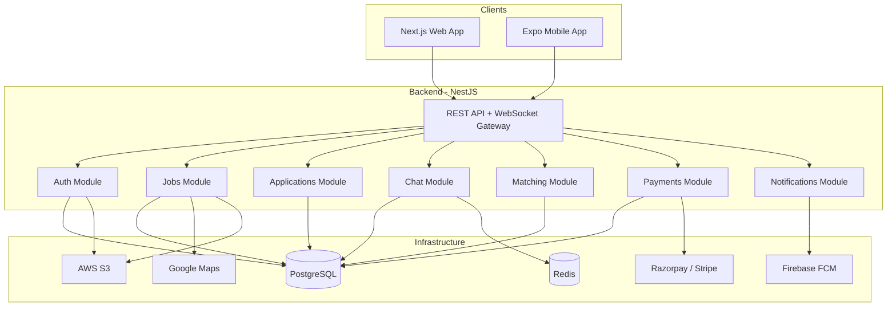
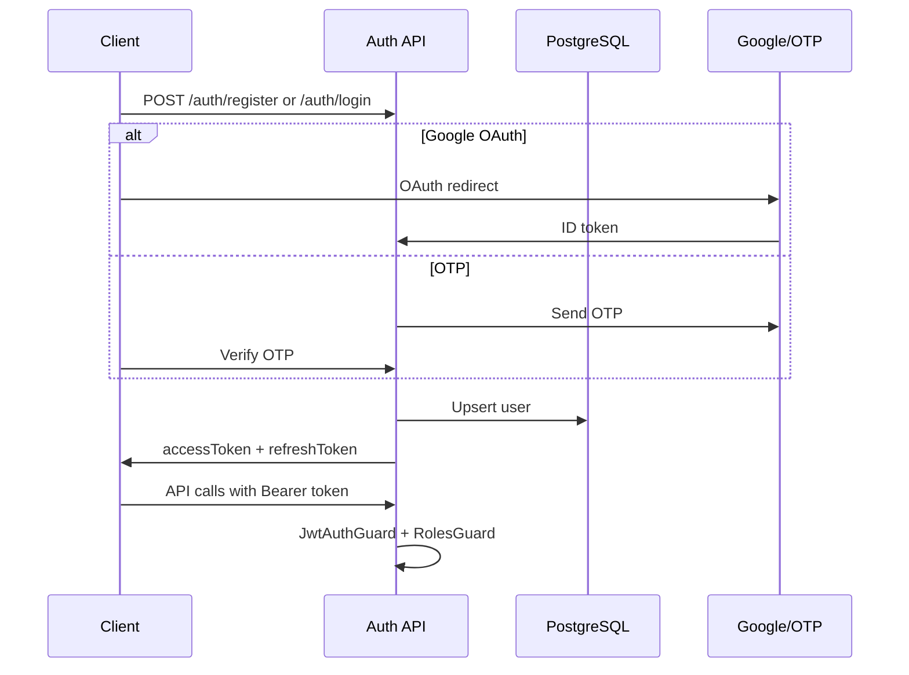

# System Architecture

## High-Level Overview

## Module Boundaries

| Module | Responsibility |
|--------|----------------|
| **Auth** | JWT, Google OAuth, OTP, refresh tokens, role guards |
| **Users** | Profiles (employer/student), verification, settings |
| **Jobs** | CRUD, search, filters, featured listing |
| **Applications** | Apply, status pipeline, resume download |
| **Matching** | Skill/location/experience scoring (0–100%) |
| **Chat** | Socket.io rooms, text/image/file, interview scheduling |
| **Notifications** | FCM push, in-app notification store |
| **Payments** | Subscription plans, Razorpay/Stripe webhooks |
| **Admin** | Moderation, analytics, verification approval |
| **Upload** | S3 presigned URLs for logos, resumes, photos |

## Authentication Flow

## Real-Time Chat

- Socket.io namespace `/chat`
- Rooms: `conversation:{id}`
- Events: `join`, `message`, `typing`, `read`, `schedule_interview`
- Messages persisted in PostgreSQL; Redis optional for presence

## AI Matching Algorithm

Weighted score (0–100):

| Factor | Weight |
|--------|--------|
| Skills overlap | 40% |
| Education match | 20% |
| Experience match | 20% |
| Location proximity | 20% |

Computed on apply and cached in `Application.matchScore`.

## Security

- bcrypt password hashing
- JWT access (15m) + refresh (7d) rotation
- Rate limiting on auth endpoints
- Helmet, CORS, validation pipes
- Role-based access (EMPLOYER, STUDENT, ADMIN)
- S3 presigned URLs (no direct bucket access)

## Deployment Topology

| Service | Platform |
|---------|----------|
| Frontend | Vercel |
| API | AWS ECS / DigitalOcean App Platform |
| PostgreSQL | Neon / RDS / Supabase |
| Redis | Upstash / ElastiCache |
| S3 | AWS S3 |
| Mobile | EAS Build → App Store / Play Store |
